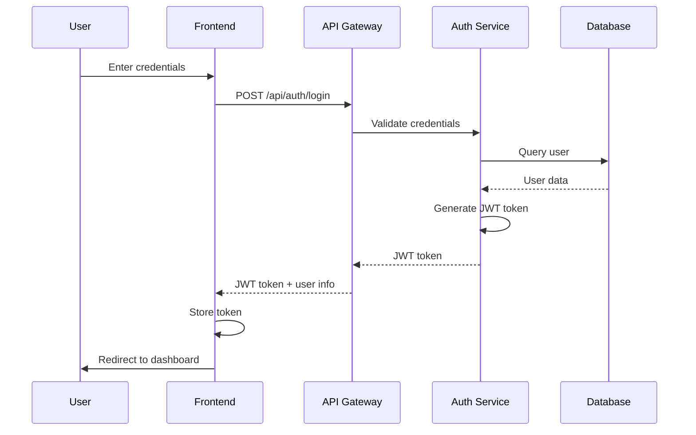
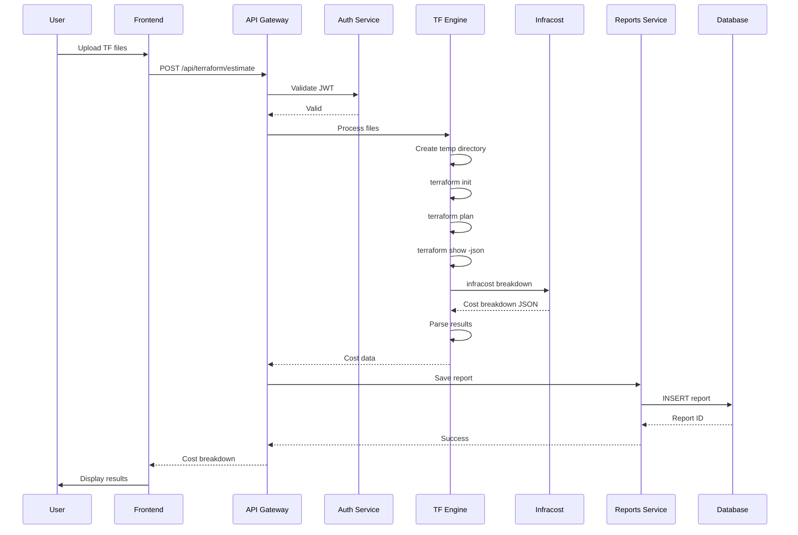
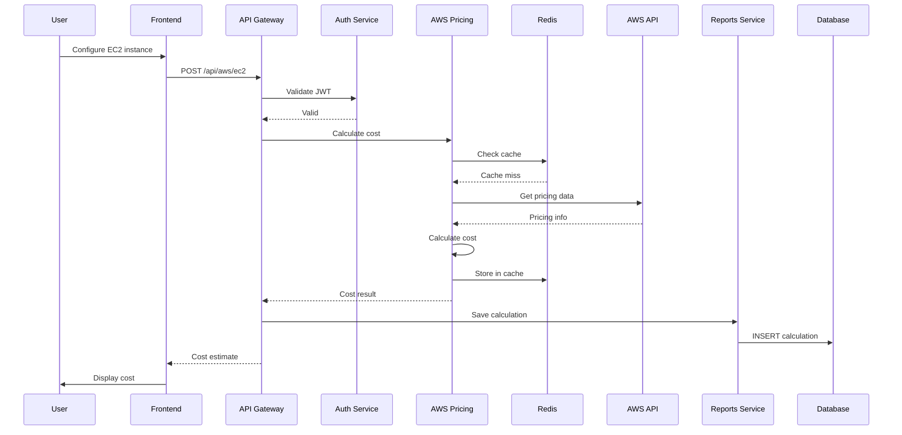
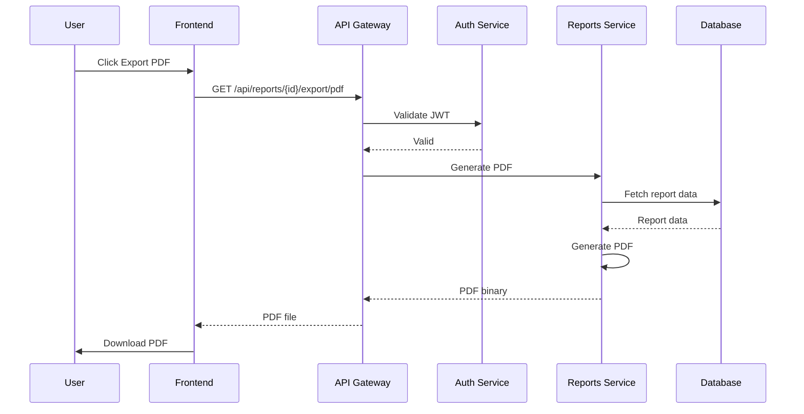

# Sequence Diagrams

## User Authentication Flow

```mermaid
sequenceDiagram
    participant User
    participant Frontend
    participant API Gateway
    participant Auth Service
    participant Database

    User->>Frontend: Enter credentials
    Frontend->>API Gateway: POST /api/auth/login
    API Gateway->>Auth Service: Validate credentials
    Auth Service->>Database: Query user
    Database-->>Auth Service: User data
    Auth Service->>Auth Service: Generate JWT token
    Auth Service-->>API Gateway: JWT token
    API Gateway-->>Frontend: JWT token + user info
    Frontend->>Frontend: Store token
    Frontend->>User: Redirect to dashboard
```

## Terraform Cost Estimation Flow

```mermaid
sequenceDiagram
    participant User
    participant Frontend
    participant API Gateway
    participant Auth Service
    participant TF Engine
    participant Infracost
    participant Reports Service
    participant Database

    User->>Frontend: Upload TF files
    Frontend->>API Gateway: POST /api/terraform/estimate
    API Gateway->>Auth Service: Validate JWT
    Auth Service-->>API Gateway: Valid
    API Gateway->>TF Engine: Process files
    TF Engine->>TF Engine: Create temp directory
    TF Engine->>TF Engine: terraform init
    TF Engine->>TF Engine: terraform plan
    TF Engine->>TF Engine: terraform show -json
    TF Engine->>Infracost: infracost breakdown
    Infracost-->>TF Engine: Cost breakdown JSON
    TF Engine->>TF Engine: Parse results
    TF Engine-->>API Gateway: Cost data
    API Gateway->>Reports Service: Save report
    Reports Service->>Database: INSERT report
    Database-->>Reports Service: Report ID
    Reports Service-->>API Gateway: Success
    API Gateway-->>Frontend: Cost breakdown
    Frontend->>User: Display results
```

## AWS Cost Calculator Flow

```mermaid
sequenceDiagram
    participant User
    participant Frontend
    participant API Gateway
    participant Auth Service
    participant AWS Pricing
    participant Redis
    participant AWS API
    participant Reports Service
    participant Database

    User->>Frontend: Configure EC2 instance
    Frontend->>API Gateway: POST /api/aws/ec2
    API Gateway->>Auth Service: Validate JWT
    Auth Service-->>API Gateway: Valid
    API Gateway->>AWS Pricing: Calculate cost
    AWS Pricing->>Redis: Check cache
    Redis-->>AWS Pricing: Cache miss
    AWS Pricing->>AWS API: Get pricing data
    AWS API-->>AWS Pricing: Pricing info
    AWS Pricing->>AWS Pricing: Calculate cost
    AWS Pricing->>Redis: Store in cache
    AWS Pricing-->>API Gateway: Cost result
    API Gateway->>Reports Service: Save calculation
    Reports Service->>Database: INSERT calculation
    API Gateway-->>Frontend: Cost estimate
    Frontend->>User: Display cost
```

## Report Export Flow

```mermaid
sequenceDiagram
    participant User
    participant Frontend
    participant API Gateway
    participant Auth Service
    participant Reports Service
    participant Database

    User->>Frontend: Click Export PDF
    Frontend->>API Gateway: GET /api/reports/{id}/export/pdf
    API Gateway->>Auth Service: Validate JWT
    Auth Service-->>API Gateway: Valid
    API Gateway->>Reports Service: Generate PDF
    Reports Service->>Database: Fetch report data
    Database-->>Reports Service: Report data
    Reports Service->>Reports Service: Generate PDF
    Reports Service-->>API Gateway: PDF binary
    API Gateway-->>Frontend: PDF file
    Frontend->>User: Download PDF
```